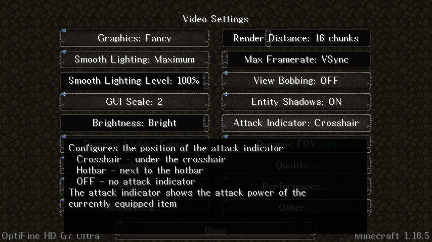

<h1>Zacalles 16px</h1>

## Overview
Beautiful and highly-legible font resource pack for Minecraft 1.16.2–1.16.5.
Currently supports basic Latin and Cyrillic scripts.

## Installation

1. Go to [this page](https://github.com/Ziphil/ZacallesMinecraft/actions/workflows/deploy.yml)
2. Click the first item of the displayed list
3. Click “Zacalles-16px” in the “Artifacts” section at the bottom of the page
4. Move the downloaded zip file to your resource pack folder of Minecraft

## Screenshorts
### Latin

 

### Cyrillic

